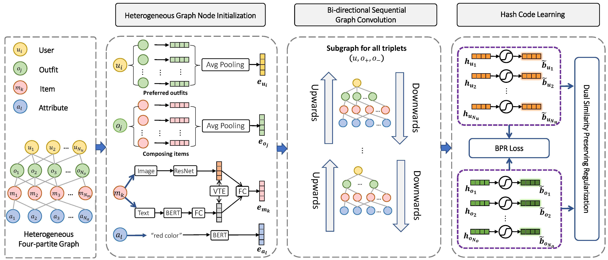

# BiHGH

Official Implementation of "Bi-directional Heterogeneous Graph Hashing towards Efficient Outfit Recommendation".



## Abstract

> Personalized outfit recommendation, which aims to recommend the outfit to a user according to his/her preference, has gained increasing research attention due to its great practical economic value. Majority of existing methods mainly focus on improving the recommendation effectiveness, while overlook the recommendation efficiency. Inspired by this, we devise a novel bi-directional heterogeneous graph hashing scheme, BiHGH for short, towards efficient personalized outfit recommendation. In particular, this scheme consists of three key components: heterogeneous graph node embedding, bi-directional sequential graph convolution, and hash code learning. We first unify four types of entities (i.e., users, outfits, items, and attributes) and their relations with a heterogeneous four-partite graph. We then creatively devise a bi-directional sequential graph convolution paradigm to sequentially and repeatedly transferring knowledge from top-down and down-top directions, whereby we divide the four-partite graph into three subgraphs, each of which include two adjacent levels of entities. Finally, we adopt the commonly used Bayesian Personalized Ranking loss for the user preference learning, and design the bi-level similarity preserving regularization to prevent the information loss during the hash learning. Extensive experiments on three benchmark datasets demonstrate the superiority of BiHGH.

## Data Preparation

We have provided the data files used in the `/data` folder, including edge files and node initialization features used to build the graph.

>Edge files: <a href="https://www.aliyundrive.com/s/femNUcj68Vp">[download]</a> <br/>
>Train/Val/Test files: <a href="https://www.aliyundrive.com/s/femNUcj68Vp">[download]</a> <br/>
>Vocab files: <a href="https://www.aliyundrive.com/s/femNUcj68Vp">[download]</a> <br/>
>Embedding files: <a href="https://www.aliyundrive.com/s/femNUcj68Vp">[download]</a> <br/>
>img2path.json: <a href="https://www.aliyundrive.com/s/femNUcj68Vp">[download]</a> <br/>

In addition, you also can filter the open-source dataset IQON-3000 according to the experimental details in the paper, see this <a href="https://openaccess.thecvf.com/content/CVPR2021/papers/Lu_Personalized_Outfit_Recommendation_With_Learnable_Anchors_CVPR_2021_paper.pdf">link</a>. And the filter code we used can be found at the <a href="https://github.com/lzcn/outfit-datasets/tree/fa2c0bf1df1c28d8157e8bb0cd6679480c8541e2/iqon-3000">link</a>.
After obtaining the IQON-550 dataset, we provided the data preprocessing code to obtain the above data files, see the `/preprocess` folder.

## Environment
   python 3.9.0
   
   pytorch 1.8.1
   
   You can install all the dependencies required for execution with the following command.
   
    pip install -r requirements.txt

## Configuration

Before start, the configuration file `conf/gat_tf_emb_max_v1.yaml` is supposed to be modified first.

### Train

    CUDA_VISIBLE_DEVICES=[gpu_id] python trainer.py
    

After the training is completed, the model file, configuration file and tensorboard log file will be saved to the `/experiments` folder.
### Test

Then, you can read the saved model for testing with the following command.

    CUDA_VISIBLE_DEVICES=[gpu_id] python predict.py

## Note

Any question please contact me by email: zhang.hy.2019@gmail.com

## Citation

If this work is helpful, please cite it:
```
@inproceedings{10.1145/3503161.3548020,
   author = {Guan, Weili and Song, Xuemeng and Zhang, Haoyu and Liu, Meng and Yeh, Chung-Hsing and Chang, Xiaojun},
   title = {Bi-Directional Heterogeneous Graph Hashing towards Efficient Outfit Recommendation},
   year = {2022},
   doi = {10.1145/3503161.3548020},
   booktitle = {Proceedings of the 30th ACM International Conference on Multimedia},
   pages = {268–276},
   numpages = {9}}
```

